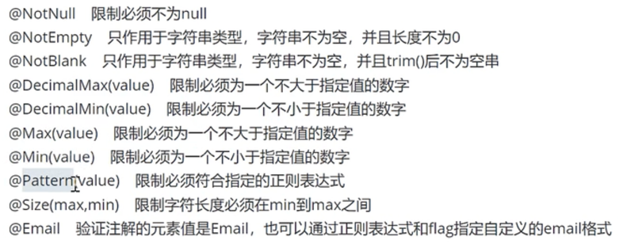

# mybatis-plus

1:引入springboot3对应的mybatis-plus框架的依赖
2:在启动类上面添加@MapperScan("com.example.mapper")的注解，并确定好扫描的包名
3:在mapper接口上面添加@Mapper的注解
4:在application.properties里面添加对应的mybatis的配置
5:配置mybatis-plus的xml文件位置
mybatis-plus.mapper-locations=classpath:xml/**/*.xml

# Spring Security

1：Spring Security会限制Swagger的请求，所以需要添加SpringSecurityConfig配置类让其放行相关的swagger路径。
2:默认开启CSRF防护，Swagger发出的POST/PUT请求没有CSRFToken,就会直接被拒绝（返回 403）。
需要在Spring Security配置文件中添加上放行的配置
3:默认的账号是user,密码在每次控制台进行打印。

# 静态工厂方法

通过一个 static 方法来返回一个类的实例，而不是通过 new 关键字直接调用构造器。
构建对象的方式，比用构造函数更灵活、更语义化，特别适合用在响应类、枚举转换、工具类等场景。

# BCrypt 进行密码的加密

# 校验
